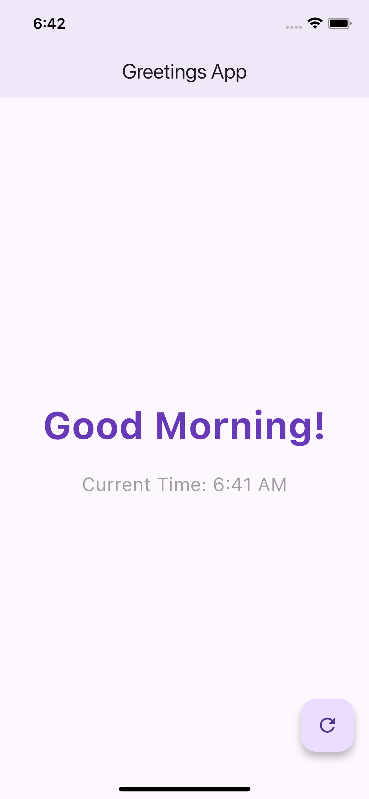
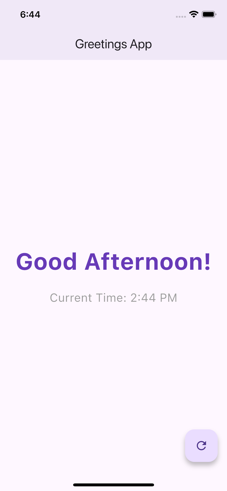
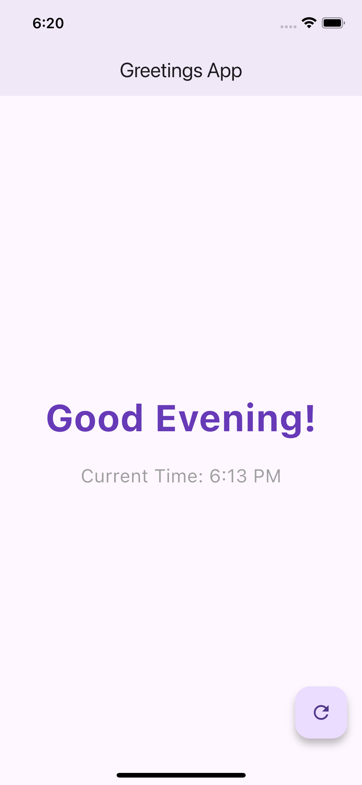

# Good Morning Flutter App

A simple Flutter application that displays a greeting message based on the time of day.

## Features
- Displays "Good Morning", "Good Afternoon", or "Good Evening" based on current time
- Shows current time
- Clean Material Design interface
- Responsive layout

## Screenshots

| Morning | Afternoon | Evening |
|---------|-----------|---------|
|  |  |  |

## Getting Started

### Prerequisites
- Flutter SDK
- Android Studio/VSCode with Flutter plugin

### Installation
1. Clone the repository
   ```bash
   git clone https://github.com/alexandrealimasi/GoodMorningApp.git
   ```
2. Navigate to project directory
   ```bash
   cd good_morning_app
   ```
3. Run the app
   ```bash
   flutter run
   ```

## How It Works
The app checks the current time using `DateTime.now().hour` and displays the appropriate greeting:
- 5:00 AM to 11:59 AM → "Good Morning!"
- 12:00 PM to 5:59 PM → "Good Afternoon!"
- 6:00 PM to 4:59 AM → "Good Evening!"
